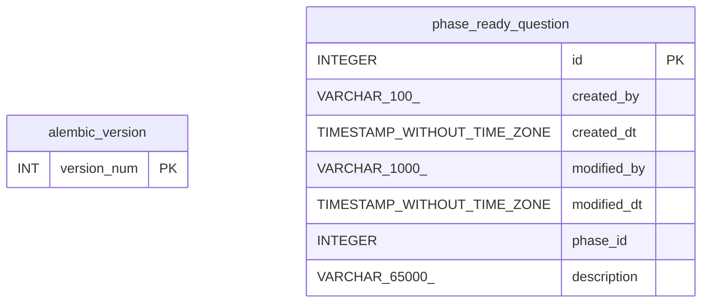

```mermaid
erDiagram
alembic_version {
   INT version_num PK
}
phase_ready_question {
    INTEGER id PK
    VARCHAR_100_ created_by 
    TIMESTAMP_WITHOUT_TIME_ZONE created_dt 
    VARCHAR_1000_ modified_by 
    TIMESTAMP_WITHOUT_TIME_ZONE modified_dt 
    INTEGER phase_id 
    VARCHAR_65000_ description 
}
```

