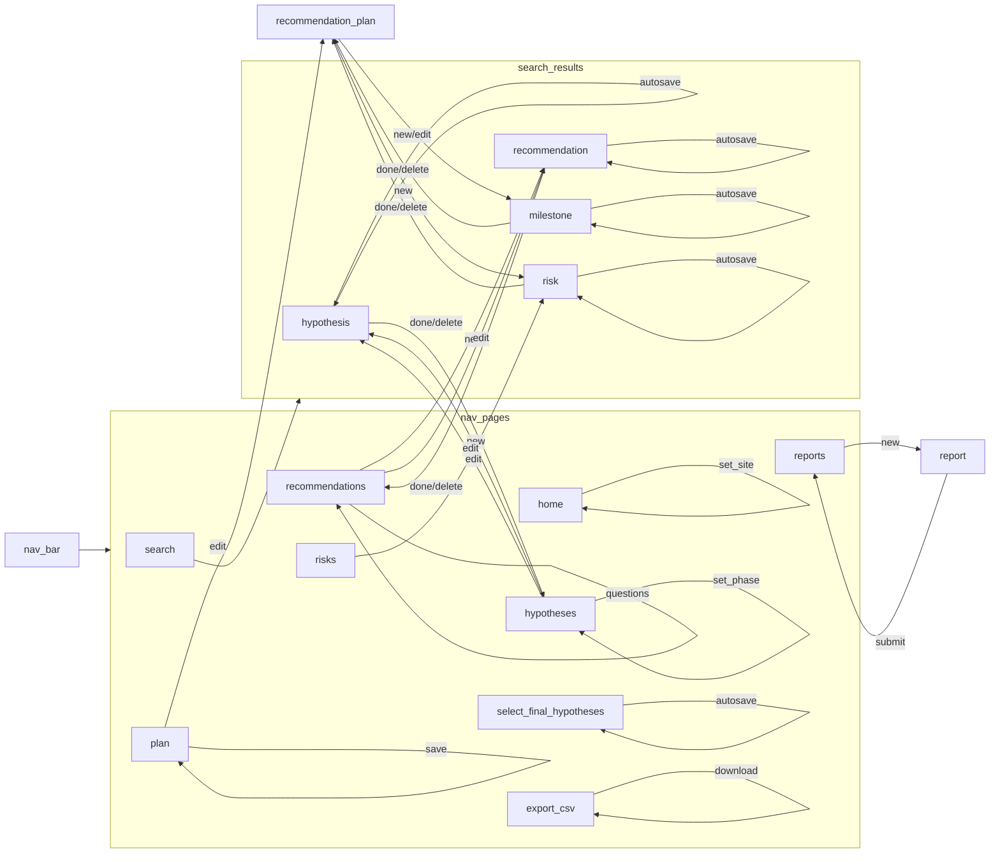

```mermaid
erDiagram
alembic_version {
    VARCHAR(32) version_num PK
}
phase_ready_question {
    INTEGER id PK
    VARCHAR(100) created_by 
    TIMESTAMP WITHOUT TIME ZONE created_dt 
    VARCHAR(1000) modified_by 
    TIMESTAMP WITHOUT TIME ZONE modified_dt 
    INTEGER phase_id 
    VARCHAR(65000) description 
}
phase {
    INTEGER id PK
    VARCHAR(100) created_by 
    TIMESTAMP WITHOUT TIME ZONE created_dt 
    VARCHAR(1000) modified_by 
    TIMESTAMP WITHOUT TIME ZONE modified_dt 
    VARCHAR(1000) name 
    VARCHAR(100) category 
}
hypothesis_recommendation {
    INTEGER hypothesis_id PK
    INTEGER recommendation_id PK
}
hypothesis {
    INTEGER id PK
    VARCHAR(100) created_by 
    TIMESTAMP WITHOUT TIME ZONE created_dt 
    VARCHAR(1000) modified_by 
    TIMESTAMP WITHOUT TIME ZONE modified_dt 
    INTEGER site_id 
    VARCHAR(1000) name 
    VARCHAR(65000) description 
    BOOLEAN organizational_risks 
    BOOLEAN intrapersonal_risks 
    BOOLEAN external_risks 
    BOOLEAN strategy_risks 
    BOOLEAN risks_burdensome_practices 
    BOOLEAN reimagining_public_safety 
    BOOLEAN change_management 
    VARCHAR(65000) supporting_findings 
    BOOLEAN active 
    VARCHAR(65000) notes 
    BOOLEAN draft 
    VARCHAR(1000) tags 
    INTEGER priority 
}
site {
    INTEGER id PK
    VARCHAR(100) created_by 
    TIMESTAMP WITHOUT TIME ZONE created_dt 
    VARCHAR(1000) modified_by 
    TIMESTAMP WITHOUT TIME ZONE modified_dt 
    VARCHAR(1000) name 
    BOOLEAN active 
    TIMESTAMP WITHOUT TIME ZONE end_dt 
    TIMESTAMP WITHOUT TIME ZONE start_dt 
}
recommendation {
    INTEGER id PK
    VARCHAR(100) created_by 
    TIMESTAMP WITHOUT TIME ZONE created_dt 
    VARCHAR(1000) modified_by 
    TIMESTAMP WITHOUT TIME ZONE modified_dt 
    INTEGER site_id 
    VARCHAR(1000) name 
    VARCHAR(65000) description 
    VARCHAR(65000) done_criteria 
    VARCHAR(65000) success_criteria 
    VARCHAR(100) impact_rating 
    VARCHAR(65000) supporting_findings 
    BOOLEAN organizational_risks 
    BOOLEAN intrapersonal_risks 
    BOOLEAN external_risks 
    BOOLEAN strategy_risks 
    BOOLEAN risks_burdensome_practices 
    BOOLEAN reimagining_public_safety 
    BOOLEAN change_management 
    VARCHAR(1000) timeline 
    INTEGER priority 
    BOOLEAN active 
    TIMESTAMP WITHOUT TIME ZONE end_dt 
    TIMESTAMP WITHOUT TIME ZONE start_dt 
    VARCHAR(65000) supporting_resources 
}
recommendation_rel {
    INTEGER id PK
    INTEGER recommendation_from_id 
    INTEGER recommendation_to_id 
}
report {
    INTEGER id PK
    VARCHAR(100) created_by 
    TIMESTAMP WITHOUT TIME ZONE created_dt 
    VARCHAR(1000) modified_by 
    TIMESTAMP WITHOUT TIME ZONE modified_dt 
    INTEGER site_id 
    VARCHAR(1000) name 
    VARCHAR(65000) description 
    TIMESTAMP WITHOUT TIME ZONE report_date 
    BYTEA pdf 
    BYTEA docx 
}
phase_ready_answer {
    INTEGER id PK
    VARCHAR(100) created_by 
    TIMESTAMP WITHOUT TIME ZONE created_dt 
    VARCHAR(1000) modified_by 
    TIMESTAMP WITHOUT TIME ZONE modified_dt 
    INTEGER site_id 
    INTEGER question_id 
    BOOLEAN answered 
    VARCHAR(65000) text 
}
risk {
    INTEGER id PK
    VARCHAR(100) created_by 
    TIMESTAMP WITHOUT TIME ZONE created_dt 
    VARCHAR(1000) modified_by 
    TIMESTAMP WITHOUT TIME ZONE modified_dt 
    INTEGER milestone_id 
    VARCHAR(1000) name 
    VARCHAR(65000) description 
    VARCHAR(100) category 
    VARCHAR(100) impact 
    VARCHAR(100) likelihood 
    VARCHAR(65000) solution 
}
milestone {
    INTEGER id PK
    VARCHAR(100) created_by 
    TIMESTAMP WITHOUT TIME ZONE created_dt 
    VARCHAR(1000) modified_by 
    TIMESTAMP WITHOUT TIME ZONE modified_dt 
    INTEGER recommendation_id 
    VARCHAR(1000) name 
}
vision {
    INTEGER id PK
    VARCHAR(100) created_by 
    TIMESTAMP WITHOUT TIME ZONE created_dt 
    VARCHAR(1000) modified_by 
    TIMESTAMP WITHOUT TIME ZONE modified_dt 
    INTEGER site_id 
    VARCHAR(65000) description 
}
response {
    INTEGER id PK
    VARCHAR(100) created_by 
    TIMESTAMP WITHOUT TIME ZONE created_dt 
    VARCHAR(1000) modified_by 
    TIMESTAMP WITHOUT TIME ZONE modified_dt 
    INTEGER site_id 
    INTEGER question_id 
    VARCHAR(65000) text 
    BOOLEAN boolean_response 
}
question {
    INTEGER id PK
    VARCHAR(100) created_by 
    TIMESTAMP WITHOUT TIME ZONE created_dt 
    VARCHAR(1000) modified_by 
    TIMESTAMP WITHOUT TIME ZONE modified_dt 
    INTEGER phase_id 
    VARCHAR(1000) name 
    VARCHAR(65000) description 
    BOOLEAN is_boolean 
    BOOLEAN allow_input 
}
tag {
    INTEGER id PK
    VARCHAR(100) created_by 
    TIMESTAMP WITHOUT TIME ZONE created_dt 
    VARCHAR(1000) modified_by 
    TIMESTAMP WITHOUT TIME ZONE modified_dt 
    INTEGER site_id 
    VARCHAR(1000) name 
}
phase_ready_override {
    INTEGER id PK
    VARCHAR(100) created_by 
    TIMESTAMP WITHOUT TIME ZONE created_dt 
    VARCHAR(1000) modified_by 
    TIMESTAMP WITHOUT TIME ZONE modified_dt 
    INTEGER site_id 
    INTEGER phase_id 
    VARCHAR(65000) text 
    VARCHAR(1000) authorizer 
}
phase o}--|o phase_ready_question
recommendation o}--|o hypothesis_recommendation
hypothesis o}--|o hypothesis_recommendation
site o}--|o hypothesis
site o}--|o recommendation
recommendation o}--|o recommendation_rel
recommendation o}--|o recommendation_rel
site o}--|o report
site o}--|o phase_ready_answer
phase_ready_question o}--|o phase_ready_answer
milestone o}--|o risk
recommendation o}--|o milestone
site o}--|o vision
site o}--|o response
question o}--|o response
phase o}--|o question
site o}--|o tag
site o}--|o phase_ready_override
phase o}--|o phase_ready_override

```



